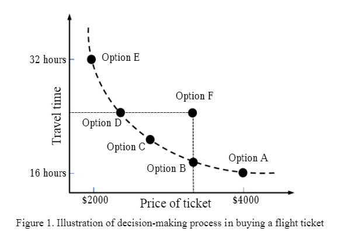

"""""""
Fitness
"""""""

Fitness class also redefines the relational operator in order to handle different types of optimization
(eg. maximization, minimization) and to provide limited support to more complex scenarios
(eg. multi-objective optimization).

How do we handle a different scenario
=====================================

When subclassing, one's fitness should only redefine 'is_fitter', and optionally 'is_distinguishable' and 'is_dominant';
'is_dominant' must be changed if 'is_fitter' is randomized (the result is uncertain).

The idea of several, different scenarios is the following:

**`a == b`**
In this case, fitness `a` cannot be distinguished from fitness `b`.

**`a != b`**
In this case, fitness `a` is distinguishable from fitness `b`.

**`a > b`**
In this case, fitness `a` is fitter than fitness `b`.
(may not always be the case, see lexicographic)

**`a >= b`**
In this case, fitness `a` is fitter or not distinguishable from fitness `b`.

**`a < b`**
In this case, fitness `b` is fitter than fitness `a`, respectively.
(may not always be the case, see lexicographic)

**`a <= b`**
In this case, fitness `b` is fitter or not distinguishable from fitness `a`, respectively.

**`a >> b`**
In this case, fitness `a` dominates fitness `b` which is a certain case.

**`a << b`**
In this case, fitness `a` is dominated by fitness `b`, accordingly.

Multi-Objective Evolutionary Algorithm
======================================

The problem becomes more interesting in case that there exist more than one characteristic that should be compared in order to decide which individual is "better".
It is very important to find rules that describe characteristics with respect to a property of interest.
The MOEA approach, a method of combining the traditional genetic algorithm (TGA) with the multi-objective method,
can consider the relation between the parameters and the objective spaces in the same time then explore the optimum solution.
Our multi-objective evolutionary algorithm uses a 'helper' function which can decide the best individual when there are two comparable characteristics.

This special Multi-Objective scenario can be illustrated with an airplaine ticket purchase.
Let us consider the example of buying a flight ticket where the price of ticket and travel time are the decision-making criteria.

blabla